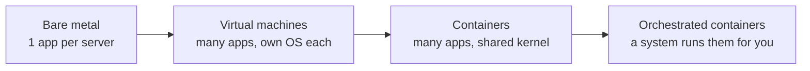
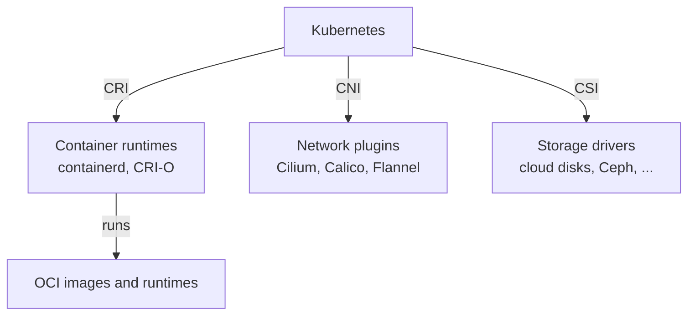

# Chapter 01: The cloud-native landscape, the CNCF, and why Kubernetes exists

> **Exams:** KCNA
> **Difficulty:** Beginner
> **Time:** ~75 min reading, ~30 min exploration exercise
> **Lab tier:** none (no cluster needed)
> **Prerequisites:** you know Linux and containers

## Learning objectives

After this chapter you can:

- Explain the problems that appear when you run containers at scale, and how an orchestrator addresses each
- Describe where Kubernetes came from and how its releases are produced
- Define "cloud native" and apply the twelve-factor principles to an application
- Contrast monolith and microservices, mutable and immutable infrastructure, imperative and declarative management
- Describe the CNCF: what it is, how it is organized, and what sandbox, incubating, and graduated mean
- Place well-known projects on the landscape by the problem they solve
- Name the open standards Kubernetes relies on (OCI, CRI, CNI, CSI) and say what each standardizes
- Explain how the Kubernetes community is governed: SIGs, KEPs, release cycle, feature stages

## 1. From servers to orchestrators

You already run containers. It helps to see why that stopped being enough.

*Text description: infrastructure evolved from one application per physical server, to virtual machines, to containers sharing a host kernel, to orchestrators that run containers across many machines.*

Containers are lightweight because they share the host's kernel and isolate processes with namespaces and cgroups, unlike VMs, which each carry a full guest OS. That makes them fast to start and dense to pack. It also means a container is a *process*, and running one process on one machine is easy. Running hundreds across dozens of machines is a different problem.

### What containers alone do not solve

| Problem at scale | Question you now have to answer | Kubernetes' answer |
|---|---|---|
| Placement | Which machine has room for this container? | The scheduler |
| Self-healing | What restarts it when it crashes or the machine dies? | Controllers and the kubelet |
| Scaling | How do I add or remove copies as load changes? | Replica counts, autoscalers |
| Rollouts | How do I ship a new version without downtime, and undo it? | Deployments, rolling updates |
| Discovery | How do other services find the ones that move around? | Services and cluster DNS |
| Load balancing | How is traffic spread over the copies? | Services, Ingress/Gateway |
| Configuration | How do I inject settings and secrets without rebuilding images? | ConfigMaps and Secrets |
| Storage | How does a moved container find its data? | Volumes, PersistentVolumes |
| Consistency | How do I describe the whole system and keep it that way? | Declarative API and reconciliation |

An **orchestrator** is a system that takes a description of what you want running and continuously works to make reality match. Kubernetes is the dominant one. Docker Swarm and Nomad are alternatives you may meet.

## 2. Where Kubernetes came from

Google ran containers at massive scale for years using an internal cluster manager called **Borg** (and a later system called Omega). The lessons from those systems shaped Kubernetes, which Google open sourced in 2014. Kubernetes 1.0 shipped in July 2015, and in the same month Google and others donated it to the newly formed **Cloud Native Computing Foundation (CNCF)**, part of the Linux Foundation. It was the CNCF's first hosted project.

The name is Greek for "helmsman" or "pilot". You will see it abbreviated **K8s** (K, eight letters, s).

### How Kubernetes is released

- New **minor** versions (1.35, 1.36, ...) ship on a regular cadence of roughly three per year.
- Each minor version gets patch releases for a limited period (about a year), so you must upgrade regularly. Chapter 19 covers upgrades.
- The exams are written against a specific minor version, so the labs in this book pin one in `versions.env`.

Check kubernetes.io for the current supported versions; the list changes with every release.

## 3. What "cloud native" means

"Cloud native" is not "runs in the cloud". The CNCF's definition, paraphrased: cloud-native technologies let organizations build and run scalable applications in modern, dynamic environments such as public, private, and hybrid clouds. Containers, service meshes, microservices, immutable infrastructure, and declarative APIs are typical examples. These techniques produce systems that are loosely coupled, resilient, manageable, and observable, and combined with robust automation they let engineers make high-impact changes frequently and predictably with minimal toil.

Notice what is described: **properties** (resilient, observable, automated), not a product list. An application on a VM in your own datacenter can be more cloud native than a lift-and-shifted one in a public cloud.

### Building blocks

**Microservices vs monolith.** A monolith is deployed as one unit. Microservices split an application into small, independently deployable services that communicate over the network.

| | Monolith | Microservices |
|---|---|---|
| Deploy | All at once | Each service independently |
| Scale | Everything together | Only what needs it |
| Failure | One bug can take down everything | Failures can be contained (if designed for it) |
| Cost | Simple to start | Operational complexity: networking, tracing, versioning |

Microservices are a trade-off, not an upgrade. Kubernetes makes many services manageable, but it does not make a poorly split system good.

**Immutable infrastructure.** You never patch a running server or container. You build a new image, deploy it, and discard the old one. This eliminates configuration drift and makes rollback a redeploy of the previous image.

**Declarative vs imperative.**

- *Imperative:* "start three copies of this container" (a sequence of commands)
- *Declarative:* "there should be three copies of this container" (a description of the end state)

Kubernetes is built on the declarative model. You submit the desired state; the system's controllers keep comparing it with what is actually running and fix any difference. Chapter 02 explains how.

**Infrastructure as code and GitOps.** Describing infrastructure in files that live in version control makes changes reviewable and repeatable. **GitOps** goes further: a Git repository is the single source of truth, and an agent in the cluster continuously pulls and applies it (Chapter 16).

### The twelve-factor app

The twelve-factor methodology is a widely cited set of design rules for services that run well in dynamic platforms. Learn the factors and how Kubernetes supports them:

| # | Factor | In one line | Kubernetes tie-in |
|---|---|---|---|
| 1 | Codebase | One codebase, many deploys | Same image promoted across environments |
| 2 | Dependencies | Declare and isolate them | Dependencies baked into the image |
| 3 | Config | Keep config out of code, in the environment | ConfigMaps, Secrets, env vars |
| 4 | Backing services | Treat databases and queues as attached resources | Services and DNS names |
| 5 | Build, release, run | Strictly separate the stages | CI builds images; Deployments run them |
| 6 | Processes | Stateless, share-nothing processes | Pods are replaceable |
| 7 | Port binding | Export services by listening on a port | Container ports, Services |
| 8 | Concurrency | Scale out with more processes | Replicas, autoscaling |
| 9 | Disposability | Fast start, graceful shutdown | Probes, SIGTERM and grace periods |
| 10 | Dev/prod parity | Keep environments similar | Same manifests, different values |
| 11 | Logs | Treat logs as event streams to stdout | `kubectl logs`, log collectors |
| 12 | Admin processes | Run one-off tasks as processes | Jobs |

## 4. The CNCF

The **Cloud Native Computing Foundation** is a vendor-neutral home for open-source cloud-native projects, under the Linux Foundation. Its goals are to grow and sustain that ecosystem, and to make the technologies accessible to everyone.

### How it is organized

- **Governing Board:** business and marketing decisions, budget
- **Technical Oversight Committee (TOC):** technical vision, accepts projects, sets maturity
- **Technical Advisory Groups (TAGs):** domain groups (security, observability, application delivery, and others) that advise the TOC and produce guidance
- **End User Community:** companies that use cloud-native tech and give feedback
- **Projects:** each with its own maintainers and governance

### Project maturity levels

Projects move through levels as they prove adoption and governance:

| Level | Meaning |
|---|---|
| **Sandbox** | Early-stage, experimental; the CNCF hosts it and offers visibility |
| **Incubating** | Growing adoption in production, healthy contributors, defined governance |
| **Graduated** | Broad production use, strong governance, security practices, and a proven community |

Archived projects have been retired. The exam expects you to know these three levels and to recognize where the flagship projects sit. Graduated projects you should know include Kubernetes, Prometheus, Envoy, containerd, CoreDNS, etcd, and Helm. Maturity levels change over time, so verify any specific project on the CNCF site rather than memorizing a list.

> **Do not confuse** project maturity with **Kubernetes conformance**. The CNCF also runs a Certified Kubernetes program that tests whether a distribution or hosted service implements the Kubernetes API correctly. That is about products, not project maturity.

### The landscape

The CNCF landscape (landscape.cncf.io) maps hundreds of projects and products. Do not try to memorize it. Learn the *categories* and one or two flagships in each:

| Category | Problem it solves | Well-known projects |
|---|---|---|
| Container runtime | Runs containers on a node | containerd, CRI-O |
| Orchestration | Schedules and manages containers | Kubernetes |
| Cluster DNS and service discovery | Names for services | CoreDNS |
| Networking (CNI) | Pod-to-pod networking and policy | Cilium, Calico, Flannel |
| Service mesh and proxies | mTLS, traffic control, telemetry between services | Istio, Linkerd, Envoy |
| Metrics and monitoring | Numbers over time, alerts | Prometheus |
| Logging | Collect and route logs | Fluentd, Fluent Bit |
| Tracing and telemetry | Follow a request across services | Jaeger, OpenTelemetry |
| Key-value store | Consistent cluster state | etcd |
| Packaging | Bundle and version app manifests | Helm |
| Continuous delivery / GitOps | Deploy from Git | Argo CD, Flux |
| Storage | Persistent volumes | Rook, Longhorn |
| Policy and security | Admission control, runtime security | OPA/Gatekeeper, Kyverno, Falco |
| Autoscaling | Scale on events and load | KEDA |

Some projects listed here are not CNCF projects (Calico and Flannel, for example, are widely used CNI plugins that live elsewhere). Whether something is a CNCF project is a separate question from whether it is important.

## 5. Open standards

Kubernetes avoids hard-wiring a specific technology by defining **interfaces**. Anyone can implement them, and you can swap the implementation.

*Text description: Kubernetes talks to runtimes through CRI, to network plugins through CNI, and to storage drivers through CSI; runtimes run OCI-compliant images.*

| Standard | Stands for | What it standardizes |
|---|---|---|
| **OCI** | Open Container Initiative | Image format, runtime specification, and distribution (how registries serve images) |
| **CRI** | Container Runtime Interface | How the kubelet talks to a container runtime |
| **CNI** | Container Network Interface | How networking is set up for containers |
| **CSI** | Container Storage Interface | How storage systems plug in |

Because images follow OCI, an image you built with Docker runs under containerd or CRI-O without change. Kubernetes removed its built-in Docker integration (dockershim) years ago; today it talks to runtimes through CRI.

## 6. Project profiles

Short profiles of projects you will meet again in this book. For each: the problem, and where it appears.

**containerd.** A container runtime originally split out of Docker, now a graduated CNCF project. It pulls images, manages container lifecycle, and implements CRI. It is the runtime inside most Kubernetes nodes, including your kind cluster. Chapters 02, 32.

**etcd.** A distributed, consistent key-value store based on the Raft consensus algorithm. Kubernetes stores all cluster state in it, and only the API server talks to it. Losing etcd without a backup means losing the cluster's state. Chapters 02, 20.

**CoreDNS.** A flexible, plugin-based DNS server. In a cluster it answers queries so that a Service name resolves to an address. Chapters 11, 21.

**Prometheus.** A metrics system that scrapes numeric time series from targets over HTTP, stores them, and evaluates alert rules, queried with PromQL. It is the de facto metrics standard in Kubernetes. Chapters 15, 35.

**Envoy.** A high-performance proxy, the data plane for many service meshes and gateways. Chapters 12, 28, 36.

**Helm.** The "package manager for Kubernetes": charts bundle templated manifests with configurable values and versioned releases. Chapter 14.

**Argo CD (and Flux).** GitOps controllers that watch a Git repository and keep the cluster in sync with it. Chapter 16.

**Cilium.** A networking, security, and observability project built on eBPF in the Linux kernel. It can be your cluster's CNI, replace kube-proxy, and enforce network policy. Chapters 21, 36.

## 7. Community and governance

Kubernetes is developed in the open by a large community, organized like this:

- **SIGs (Special Interest Groups)** own areas of the project: SIG Node, SIG Network, SIG Storage, SIG Auth, SIG Scheduling, SIG CLI (kubectl), and many more. Each has chairs, a charter, and regular public meetings.
- **Working groups** tackle cross-cutting topics for a limited time.
- **KEPs (Kubernetes Enhancement Proposals)** are the design documents for significant changes. A KEP describes the motivation, design, risks, and graduation criteria, and is reviewed in public before work lands.
- **The Steering Committee** provides overall project governance. The community follows a Code of Conduct.
- **Release teams** rotate each release cycle: a release lead, docs, communications, and others coordinate the schedule.

### Feature maturity stages

New features and APIs graduate through stages:

| Stage | Behavior |
|---|---|
| **Alpha** | Off by default; may be buggy; can change or be removed without notice |
| **Beta** | Better tested; the design is mostly settled, but details can still change |
| **Stable (GA)** | Enabled by default, supported, and covered by the deprecation policy |

Features are controlled by **feature gates** on the components. Stable APIs are not removed without a long deprecation period; check the deprecation policy on kubernetes.io before relying on an old API version.

### Personas

Cloud-native organizations split responsibilities across roles. Chapter 28 covers this in more depth, but recognize the common ones now: **developer** (builds the app), **platform engineer** (builds the internal platform others deploy to), **cluster administrator** (runs and upgrades clusters), **SRE** (reliability and incident response), **security engineer**, and increasingly **FinOps** practitioners (cost).

## 8. Where Kubernetes runs

You can run Kubernetes yourself (kubeadm, or single-node tools like kind, minikube, and k3s for learning) or use a **managed service** from a cloud provider that operates the control plane for you. A **distribution** bundles Kubernetes with additional components and support. They all present the same Kubernetes API, which is what conformance testing checks. The exams, and this book, target upstream Kubernetes.

## Exploration exercise (no cluster required)

You need a browser. Work through these and note the answers.

1. Open the CNCF project list at cncf.io and, for each of these projects, record its **maturity level** and its **category**: containerd, Prometheus, Helm, Cilium, OpenTelemetry, Argo.
2. On kubernetes.io, find the **release page**. Which minor versions currently receive patch releases? Which is the newest? How does that compare with the version pinned in this book's `versions.env`?
3. In the Kubernetes community repository, find the SIG that owns `kubectl`, and its charter.
4. Find one open KEP and write down its **stage** (alpha, beta, or stable) and which SIG owns it.
5. Pick any three projects from the landscape that you have not heard of. In one sentence each, say what problem they solve, using this chapter's categories.

There are no automated checks for this exercise. Compare your answers with a study partner or the community documentation.

## Exam tips

> **Exam tip:** KCNA is multiple choice, so **precision of vocabulary** matters. Know exactly what CRI, CNI, CSI, and OCI each standardize; questions often swap them.

> **Exam tip:** Expect "which project solves this problem" questions. Learn categories first, then flagships: Prometheus (metrics), Fluentd (logging), Jaeger (tracing), Envoy (proxy), etcd (state), Helm (packaging), Argo CD/Flux (GitOps).

> **Exam tip:** Know the three maturity levels in order, and that graduation reflects adoption and governance maturity, not "quality" alone.

## Common misconceptions

- "Cloud native means running in the public cloud." It describes properties of systems, not their location.
- "Kubernetes is a container runtime." It orchestrates containers through a runtime.
- "Docker is required for Kubernetes." Kubernetes uses CRI runtimes such as containerd. Docker-built images still work because of OCI.
- "Every CNCF project is graduated." Many are sandbox or incubating.
- "Microservices are always better than monoliths." They trade simplicity for flexibility.

<!-- QUESTIONS:START -->
<!-- QUESTIONS:END -->

## Further reading

- The CNCF website: project list, maturity criteria, the TOC and TAGs
- The CNCF landscape (landscape.cncf.io)
- The twelve-factor app methodology (12factor.net)
- Kubernetes documentation: *Kubernetes Components*, *Release cycle*, *Version skew policy*
- The Kubernetes community repository: SIG list and the enhancements (KEP) repository
- Chapter 02 next: the architecture behind everything described here
