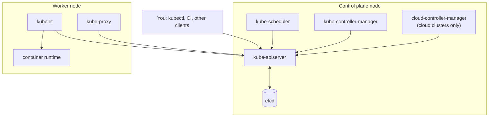
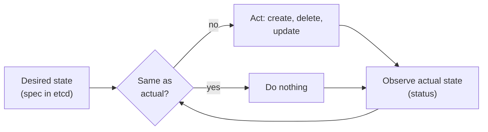
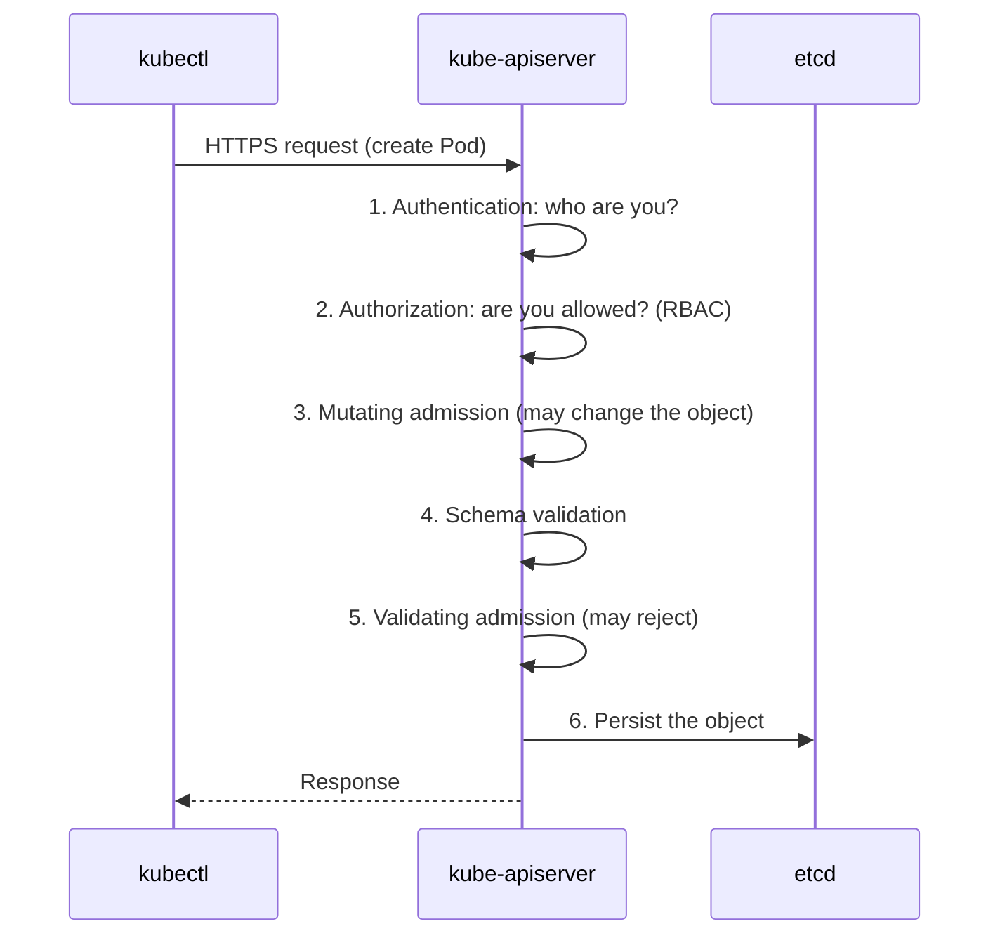
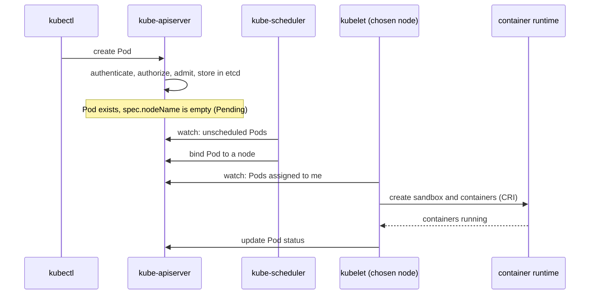

# Chapter 02: Kubernetes architecture

> **Exams:** KCNA · CKA (also the foundation for CKAD and CKS)
> **Difficulty:** Beginner
> **Time:** ~75 min reading, ~30 min lab
> **Lab tier:** 1 (kind)
> **Prerequisites:** Chapter 01. Chapter 03 teaches `kubectl` in depth; this chapter includes only the primer you need for the lab.

## Learning objectives

After this chapter you can:

- Name every control plane and node component and say what it does
- Explain why the API server is the hub of the cluster and the only component that talks to etcd
- Describe the declarative model and the reconciliation loop
- Trace an API request through authentication, authorization, admission, and storage
- Trace what happens, component by component, when you create a Pod
- Explain what static Pods are and why kubeadm clusters run the control plane as static Pods
- Read a resource's API group, version, and kind, and tell namespaced from cluster-scoped resources
- Read a kubeconfig file: clusters, users, contexts
- Explore a running cluster with `kubectl` without changing it

## Concepts

### The big picture

A Kubernetes **cluster** is a set of machines (**nodes**) split into two roles:

- The **control plane** makes global decisions and holds the cluster's state.
- **Worker nodes** run your application containers.



*Text description: clients and every other component talk to the kube-apiserver, which is the only component that reads and writes etcd. The scheduler, controller manager, and cloud controller manager sit on the control plane; each worker node runs a kubelet, kube-proxy, and a container runtime, and the kubelet and kube-proxy talk to the API server.*

Notice the shape: a **hub and spoke** around the API server. Components do not call each other directly. They read and write objects through the API server and react to changes. That is the key to understanding everything else in this chapter.

### Control plane components

| Component | Role |
|---|---|
| **kube-apiserver** | The front door. Exposes the Kubernetes API over HTTPS, authenticates and authorizes requests, validates and stores objects. The only component that talks to etcd. Stateless: you can run several behind a load balancer. |
| **etcd** | A consistent, distributed key-value store (Raft consensus) that holds all cluster state. The source of truth. Back it up. |
| **kube-scheduler** | Watches for Pods with no node assigned, picks the best node for each, and records the choice. It does not start containers. |
| **kube-controller-manager** | Runs the built-in **controllers** (node, replication, endpoints, service account, and many more) as one process. Each controller watches some objects and works to make reality match their spec. |
| **cloud-controller-manager** | Runs controllers that talk to a cloud provider's API (load balancers, node lifecycle, routes). Absent on clusters with no cloud integration, such as kind. |

A production control plane is typically **highly available**: three (or another odd number of) control plane nodes, so etcd keeps a quorum if one fails. Your kind cluster has one control plane node.

### Node components

| Component | Role |
|---|---|
| **kubelet** | The agent on every node. Watches for Pods assigned to its node, tells the container runtime to run them, runs probes, and reports status back. It runs as a system service on the node, **not** as a Pod. |
| **Container runtime** | Actually runs containers (containerd or CRI-O), driven by the kubelet through the CRI. |
| **kube-proxy** | Programs the node's network rules (iptables, IPVS, or nftables) so that traffic to a Service reaches its Pods. |

### Add-ons

Add-ons are ordinary Kubernetes workloads that provide cluster features:

- **Cluster DNS (CoreDNS):** gives Services DNS names. Effectively required.
- **A CNI plugin:** provides Pod networking. A cluster has no working Pod network without one (kind installs its own simple one).
- **Others:** metrics-server, the dashboard, ingress controllers, and so on.

### The declarative model and reconciliation

Every Kubernetes object has two key parts:

- **`spec`**: the **desired** state, written by you.
- **`status`**: the **observed** state, written by the system.

**Controllers** run a never-ending loop: *watch* objects, *compare* spec with reality, *act* to close the difference. This is called **reconciliation**.



*Text description: a controller compares desired state with actual state; if they differ, it acts and then observes again; if they match, it does nothing and keeps watching.*

Because of this, Kubernetes **self-heals**. If a node dies, the controllers notice Pods are missing and create replacements. You did not tell it "restart the Pod"; you said what should exist, and it maintains it. This is also why a manual change that fights a controller gets reverted.

### The API and how a request is processed

Everything in Kubernetes is an object in the **REST API** served by the API server. `kubectl` is just a client of that API.

Every request goes through the same pipeline:



*Text description: the API server authenticates the caller, authorizes the action, runs mutating admission, validates the schema, runs validating admission, then persists the object to etcd and responds.*

- **Authentication:** establishes identity (client certificates, tokens, and so on).
- **Authorization:** decides whether that identity may do this action. RBAC is the usual mechanism (Chapter 23).
- **Admission controllers:** code that can modify (mutating) or reject (validating) requests, for example applying defaults or enforcing policy (Chapters 30 to 33).
- Only after all of that does the object reach etcd.

**API groups, versions, and kinds.** Resources are organized into groups and versioned:

| Group | Examples | `apiVersion` in a manifest |
|---|---|---|
| core (no name) | Pod, Service, ConfigMap, Namespace, Node | `v1` |
| `apps` | Deployment, ReplicaSet, StatefulSet, DaemonSet | `apps/v1` |
| `batch` | Job, CronJob | `batch/v1` |
| `networking.k8s.io` | Ingress, NetworkPolicy | `networking.k8s.io/v1` |
| `rbac.authorization.k8s.io` | Role, ClusterRole, RoleBinding | `rbac.authorization.k8s.io/v1` |

A resource is either **namespaced** (Pods, Deployments, Services) or **cluster-scoped** (Nodes, Namespaces, PersistentVolumes, ClusterRoles). Namespaces are covered in Chapter 06.

### What happens when you create a Pod

Follow one Pod from `kubectl run` to a running container:



*Text description: kubectl creates the Pod through the API server; the scheduler sees an unscheduled Pod and binds it to a node; the kubelet on that node sees the assignment, asks the runtime to start containers, and reports status back.*

1. `kubectl` sends the request. The API server authenticates, authorizes, admits, and stores the Pod. Its `spec.nodeName` is empty, so it is `Pending`.
2. The scheduler notices the unscheduled Pod, filters out nodes that cannot fit it, scores the rest, and **binds** it by setting `spec.nodeName`.
3. The kubelet on that node notices a Pod assigned to it and asks the runtime (via CRI) to pull images and start the containers. The network plugin (CNI) sets up the Pod's network.
4. The kubelet reports the Pod's status back through the API server.

Nothing in this chain called anything directly: each component watched the API and reacted. When you create a **Deployment** instead of a Pod, extra controllers (the Deployment and ReplicaSet controllers) create the Pods for you; Chapter 05 covers that.

### How the control plane itself is run

There is a chicken-and-egg question: if the control plane components run as Pods, who starts them before there is an API server?

The answer is **static Pods**. The kubelet watches a directory of manifest files on its node (`/etc/kubernetes/manifests` on kubeadm clusters) and runs whatever Pod definitions it finds there, with no API server involved. For each one it also creates a read-only **mirror Pod** in the API so you can see it with `kubectl`.

That is how **kubeadm** clusters (including kind) run `kube-apiserver`, `etcd`, `kube-scheduler`, and `kube-controller-manager`. Edit the manifest file and the kubelet restarts the component. `kubectl delete` on a mirror Pod does not remove it: the kubelet just recreates it from the file. Chapter 17 covers static Pods in depth, and Chapters 18 to 20 and 27 use them for cluster work.

Some components are **not** static Pods: the kubelet runs as a system service, and `kube-proxy` and CoreDNS are managed through the API as a DaemonSet and a Deployment.

## `kubectl` primer for this chapter

Chapter 03 covers `kubectl` properly. You need only these for now.

```bash
kubectl get nodes                       # list a resource type
kubectl get pods -n kube-system         # -n selects a namespace
kubectl get pods -A                     # -A means all namespaces
kubectl get pods -o wide                # extra columns (node, IP)
kubectl get pods -l app=web             # filter by label
kubectl describe pod <name>             # details and recent Events
kubectl get pod <name> -o yaml          # the full object
kubectl api-resources                   # every resource type the API serves
kubectl explain pod.spec                # built-in documentation for a field
```

### kubeconfig in one minute

`kubectl` finds clusters through a **kubeconfig** file (by default `~/.kube/config`), which holds three lists and a pointer:

- **clusters:** API server addresses and their CA certificates
- **users:** credentials
- **contexts:** a named combination of cluster + user (+ optional default namespace)
- **current-context:** which context `kubectl` uses now

```bash
kubectl config get-contexts             # list contexts (* marks the current one)
kubectl config current-context
kubectl config view --minify            # just the current context
```

kind creates a context named `kind-<cluster name>` (here `kind-kbook`).

## Guided walkthrough

Start the lab so your cluster and namespace are ready:

```bash
make lab CH=2
```

The output below is **example output**; names, IPs, and ages will differ on your machine.

### Look at the nodes

```bash
kubectl get nodes -o wide
```

```text
NAME                  STATUS   ROLES           AGE   VERSION   INTERNAL-IP   ...
kbook-control-plane   Ready    control-plane   12m   v1.35.0   172.18.0.4    ...
kbook-worker          Ready    <none>          12m   v1.35.0   172.18.0.2    ...
kbook-worker2         Ready    <none>          12m   v1.35.0   172.18.0.3    ...
```

The `ROLES` column comes from node labels. Workers have no role label by default. In kind, each "node" is a Docker container, which is why they have `172.18.x.x` addresses.

### Find the control plane components

```bash
kubectl -n kube-system get pods -o wide
```

```text
NAME                                          READY   STATUS    NODE
coredns-...                                   1/1     Running   kbook-worker
etcd-kbook-control-plane                      1/1     Running   kbook-control-plane
kindnet-...                                   1/1     Running   ...
kube-apiserver-kbook-control-plane            1/1     Running   kbook-control-plane
kube-controller-manager-kbook-control-plane   1/1     Running   kbook-control-plane
kube-proxy-...                                1/1     Running   ...
kube-scheduler-kbook-control-plane            1/1     Running   kbook-control-plane
```

All the components from the diagram are here as Pods. Look at the names: the four control plane Pods end with the node name. That is the signature of a **mirror Pod**.

### Prove they are static Pods

```bash
kubectl -n kube-system get pod etcd-kbook-control-plane -o yaml | grep -A4 ownerReferences
```

```text
  ownerReferences:
  - apiVersion: v1
    controller: true
    kind: Node
    name: kbook-control-plane
```

A Pod owned by a **Node** is a mirror of a static Pod. Compare with `kube-proxy`, which is owned by a DaemonSet:

```bash
kubectl -n kube-system get pod -l k8s-app=kube-proxy -o yaml | grep -A4 ownerReferences
```

### Ask the API what it serves

```bash
kubectl api-resources | head
kubectl api-resources --api-group=apps
kubectl explain deployment.spec.replicas
```

The `APIVERSION` column of `api-resources` is what you put in a manifest's `apiVersion` field. `explain` reads documentation from the API server itself, so it matches your cluster's version.

### Watch scheduling in action

The lab created a Pod named `where-am-i`. Look at where the scheduler put it and why:

```bash
kubectl -n ch02-arch get pod where-am-i -o wide
kubectl -n ch02-arch describe pod where-am-i
```

In the `Events` section you should see a `Scheduled` event from `default-scheduler`. Events are only kept for a limited time (about an hour by default), so run `describe` soon after creating a Pod if you want to see them.

### Peek at the API server directly

`kubectl` is a client; you can call the API by hand:

```bash
kubectl get --raw /version
kubectl get --raw /api/v1/namespaces/kube-system/pods | head -c 300
```

The same request, made through `kubectl get pods -n kube-system`, is formatted for you.

### Optional: look inside a kind node

On kind, nodes are containers, so you can look at the static Pod manifests directly:

```bash
docker exec kbook-control-plane ls /etc/kubernetes/manifests
```

```text
etcd.yaml
kube-apiserver.yaml
kube-controller-manager.yaml
kube-scheduler.yaml
```

Those four files *are* the control plane. This step depends on kind and Docker; on the Tier 2 (Vagrant) environment you would use `ssh` instead. **Only look; do not edit** these files in this chapter.

## Hands-on lab

```bash
make lab CH=2        # start (or restart) the lab
make verify CH=2     # check your work
make reset CH=2      # back to the starting state
```

The lab is **read-only exploration**: nothing you do here changes the cluster. Answers go into small files under `/tmp`. Each task's expected answer is computed from your live cluster, so it will match yours even if node names differ.

### Task 1: Find the control plane node (⏱ 2 min, ★☆☆)

Save the **name of the control plane node** into `/tmp/ch02-cp-node.txt`.

*Success looks like:* the file holds the node name and nothing else.

### Task 2: Find etcd (⏱ 2 min, ★☆☆)

Save the **name of the Pod that runs etcd** into `/tmp/ch02-etcd-pod.txt`.

*Success looks like:* the file holds the exact Pod name.

### Task 3: Identify the static Pods (⏱ 5 min, ★★☆)

Save the names of **all static Pods in the `kube-system` namespace** into `/tmp/ch02-static-pods.txt`, one per line. Which components are static Pods and which are not?

*Success looks like:* the file lists exactly the static Pods' names.

### Task 4: Where did the scheduler put it? (⏱ 2 min, ★☆☆)

The Pod `where-am-i` in namespace `ch02-arch` was placed by the scheduler. Save the **name of the node it runs on** into `/tmp/ch02-pod-node.txt`.

*Success looks like:* the file holds the node name.

### Task 5: Find the API for Deployments (⏱ 3 min, ★★☆)

Find which API group and version serves **Deployments**. Save it in the form `group/version` into `/tmp/ch02-deployment-api.txt`.

*Success looks like:* the file contains the group/version string you would write in a manifest's `apiVersion`.

Stuck? Hints appear in the `verify` output. Solutions are in [`lab/solutions.md`](lab/solutions.md).

## Exam tips

> **Exam tip:** Know which components are **control plane** (apiserver, etcd, scheduler, controller-manager, cloud-controller-manager) and which are **node** components (kubelet, kube-proxy, runtime). Questions frequently ask you to sort them, and `kube-proxy` is a favorite trap: it runs on every node, not on the control plane only.

> **Exam tip:** On CKA tasks about a broken control plane, the first step is usually to check the static Pod manifests in `/etc/kubernetes/manifests` and the kubelet's logs, because the API server itself may be down and `kubectl` unusable.

> **Exam tip:** `kubectl api-resources` and `kubectl explain` work offline from the cluster. Use them to find the correct `apiVersion` and field names quickly instead of searching documentation.

> **Exam tip:** Only the API server talks to etcd. If an answer choice has the scheduler or kubelet reading etcd directly, it is wrong.

## Common mistakes

- Thinking the scheduler starts containers. It only chooses the node; the kubelet starts them.
- Thinking the kubelet runs as a Pod. It is a node service, which is why it can start the control plane Pods.
- Deleting a static Pod's mirror Pod and expecting it to go away. Remove or edit the manifest file instead.
- Forgetting `-n kube-system` and concluding the control plane Pods are missing.
- Assuming `kubectl get pods` shows every namespace. It shows the current context's namespace.

<!-- QUESTIONS:START -->

## End-of-chapter questions

**1.** `KCNA` `CKA` Which component is the only one that reads and writes etcd directly?

- **A.** kube-scheduler
- **B.** kubelet
- **C.** kube-apiserver
- **D.** kube-controller-manager

**2.** `KCNA` `CKA` Which component decides which node a new Pod will run on?

- **A.** kubelet
- **B.** kube-scheduler
- **C.** kube-proxy
- **D.** The container runtime

**3.** `KCNA` `CKA` Which component runs on every node and makes sure the containers in Pods assigned to that node are running?

- **A.** kube-apiserver
- **B.** kube-scheduler
- **C.** etcd
- **D.** kubelet

**4.** `KCNA` `CKA` Which of these is NOT a control plane component?

- **A.** kube-scheduler
- **B.** etcd
- **C.** kube-proxy
- **D.** kube-controller-manager

**5.** `KCNA` `CKA` What is the job of the kube-controller-manager?

- **A.** Storing cluster state durably
- **B.** Running controllers that reconcile actual state toward desired state
- **C.** Starting containers on nodes
- **D.** Authenticating users

**6.** `CKA` In what order does the API server process a write request?

- **A.** Admission, authorization, authentication, storage
- **B.** Authentication, authorization, admission, storage
- **C.** Authorization, authentication, storage, admission
- **D.** Storage, authentication, authorization, admission

**7.** `CKA` Which statement about static Pods is correct?

- **A.** They are created by the scheduler on request from the API server
- **B.** They are run by the kubelet from manifest files on the node, and appear in the API as mirror Pods
- **C.** They can only run in the default namespace
- **D.** Deleting the mirror Pod with kubectl removes the static Pod permanently

**8.** `KCNA` `CKA` What does etcd store in a Kubernetes cluster?

- **A.** Container images
- **B.** Application logs
- **C.** All cluster state, such as objects and their specs
- **D.** Only Secrets

**9.** `KCNA` `CKAD` `CKA` Which apiVersion do you write in a manifest for a Deployment?

- **A.** v1
- **B.** apps/v1
- **C.** batch/v1
- **D.** extensions/v1

**10.** `CKA` A kubeconfig context combines which items?

- **A.** A container image, a Pod, and a Service
- **B.** A cluster, a user, and optionally a default namespace
- **C.** A node, a Pod, and a namespace
- **D.** A certificate authority only

**11. (Task)** `CKA` `CKAD` List every resource type in the `apps` API group that the cluster serves, including its shortname and API version.

**12. (Task)** `CKA` `CKAD` A Pod named `p1` is running in the current namespace. Print only the name of the node it runs on.

**13. (Task)** `CKA` `CKAD` Without searching the web, show the built-in documentation for the `livenessProbe` field of a Pod's containers, for the version of Kubernetes your cluster runs.

<details>
<summary>Answers</summary>

**1. C.** The API server is the hub: all other components read and write cluster state through it. Only the API server talks to etcd.

**2. B.** The scheduler watches for Pods with no node, picks a node, and binds the Pod by setting its node name. It does not start containers.

**3. D.** The kubelet is the node agent. It watches for Pods assigned to its node, asks the runtime to run them, and reports status.

**4. C.** kube-proxy runs on every node and programs the network rules that implement Services. The others belong to the control plane.

**5. B.** It runs the built-in controllers, each watching objects and acting to make reality match their spec. State storage is etcd, starting containers is the kubelet and runtime, and authentication is the API server.

**6. B.** The API server first identifies the caller (authentication), then checks permission (authorization), then runs admission (mutating, validation, then validating admission), and only then persists the object to etcd.

**7. B.** The kubelet watches a manifest directory and runs those Pods itself. The API shows read-only mirror Pods. Deleting a mirror Pod just causes the kubelet to recreate it; you must remove the manifest file.

**8. C.** etcd is the consistent key-value store holding all Kubernetes API objects. Images live in registries and logs elsewhere.

**9. B.** Deployments belong to the apps API group, so the apiVersion is apps/v1. Core resources such as Pods use v1, and Jobs use batch/v1.

**10. B.** A context names a cluster plus a user, and can set a default namespace. The current-context field says which context kubectl uses.

**11.**

```bash
kubectl api-resources --api-group=apps
```

The output has columns for NAME, SHORTNAMES, APIVERSION, NAMESPACED, and KIND.

**12.**

```bash
kubectl get pod p1 -o jsonpath='{.spec.nodeName}{"\n"}'
```

`kubectl get pod p1 -o wide` also shows it, in the NODE column, but the JSONPath form prints just the value.

**13.**

```bash
kubectl explain pod.spec.containers.livenessProbe
```

Add `--recursive` to see every nested field. `explain` reads the schema from your cluster's API server, so it matches its version.

</details>

<!-- QUESTIONS:END -->

## Further reading

- Kubernetes documentation: *Kubernetes Components*, *The Kubernetes API*, *Controlling Access to the Kubernetes API*, *Static Pods*
- Kubernetes documentation: *Nodes* and *Cluster Architecture*
- Chapter 03 next: `kubectl` fluency
- Chapter 05: controllers in practice
