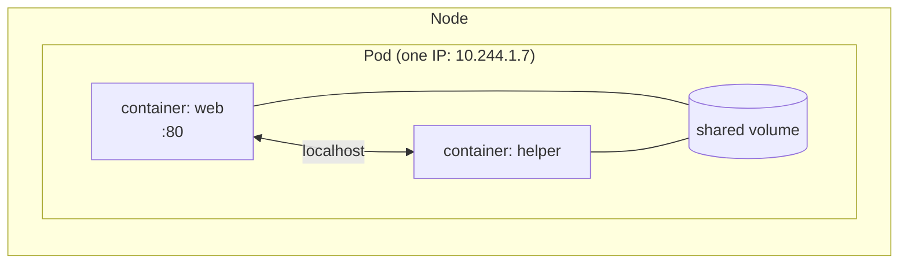
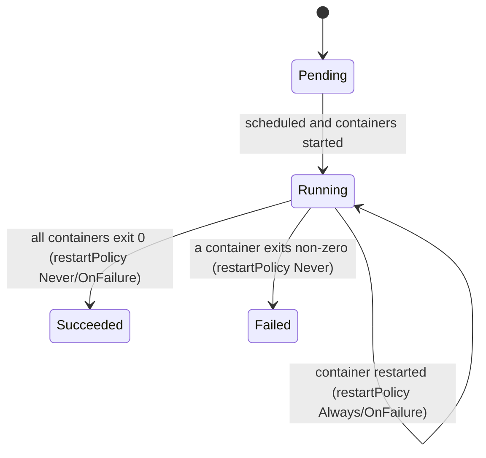

# Chapter 04: Pods in depth

> **Exams:** KCNA · CKAD · CKA
> **Difficulty:** Beginner
> **Time:** ~45 min reading, ~30 min lab
> **Lab tier:** 1 (kind)
> **Prerequisites:** Chapter 03 (lab setup and `kubectl` fluency)

## Learning objectives

After this chapter you can:

- Explain what a Pod is and why Kubernetes schedules Pods rather than containers
- Describe what containers in the same Pod share, and what they do not
- Create Pods imperatively and declaratively, and generate YAML with `--dry-run=client -o yaml`
- Read Pod status: phase, container states, and conditions
- Diagnose the common failure states: `Pending`, `ImagePullBackOff`, `CrashLoopBackOff`
- Choose a `restartPolicy` for long-running and run-to-completion workloads
- Set resource requests and limits on a container
- Use `get`, `describe`, `logs`, `exec`, `port-forward`, and `delete` fluently

## Concepts

### Why a Pod, not a container

You already know how to run a container. Kubernetes does not schedule containers
directly; it schedules **Pods**. A Pod is one or more containers that are
always placed on the same node and started, stopped, and replaced together.

Most Pods contain a single container. Multiple containers in one Pod are for
tightly coupled helpers (Chapter 09 covers the patterns).

Containers in the same Pod share:

- **The network namespace:** one IP address, one set of ports, and `localhost` reaches sibling containers
- **Volumes** that are mounted into more than one container
- Optionally the process namespace (`shareProcessNamespace: true`)

They do not share their filesystems (each has its own image layers), and each
has its own resource requests and limits.



*Text description: one Pod on a node holds two containers that talk over localhost and share a volume; the Pod has a single IP address.*

### Pods are ephemeral

A Pod is never "repaired." If it dies, or its node fails, nothing brings back
that same Pod. A **controller** (Chapter 05) creates a *replacement* Pod with a
new name and a new IP. This is why you rarely create bare Pods in production and
why the exams still make you create them constantly: they are the building block
that everything else wraps.

### The Pod lifecycle

The Pod **phase** is a coarse summary:

| Phase | Meaning |
|---|---|
| `Pending` | Accepted by the API, but not all containers are running yet (unscheduled, or pulling images) |
| `Running` | Bound to a node and at least one container is running or starting |
| `Succeeded` | All containers exited with code 0 and will not be restarted |
| `Failed` | All containers terminated, at least one with a non-zero exit code, and will not be restarted |
| `Unknown` | The node cannot be reached |

Phase is not the whole story. Each container also has a **state** (`Waiting`,
`Running`, `Terminated`) with a reason, and the Pod has **conditions**
(`PodScheduled`, `Initialized`, `ContainersReady`, `Ready`). When `kubectl get
pods` shows something like `ImagePullBackOff` or `CrashLoopBackOff` in the
`STATUS` column, that is a container's *waiting reason*, not a phase.



*Text description: Pods start `Pending`, move to `Running`, and end in `Succeeded` or `Failed` if they are not restarted.*

### Anatomy of a Pod manifest

```yaml
apiVersion: v1
kind: Pod
metadata:
  name: web
  labels:
    app: web
spec:
  restartPolicy: Always        # Always (default) | OnFailure | Never
  containers:
    - name: web
      image: nginx:1.27
      ports:
        - containerPort: 80    # informational; does not open or close anything
      resources:
        requests:              # what the scheduler reserves
          cpu: 100m
          memory: 64Mi
        limits:                # the ceiling enforced at runtime
          cpu: 200m
          memory: 128Mi
```

Every Kubernetes object has the same four top-level fields: `apiVersion`,
`kind`, `metadata`, `spec` (and `status`, which the system fills in).

**`restartPolicy`** applies to all containers in the Pod:

- `Always` (default): restart whenever a container exits. Right for servers.
- `OnFailure`: restart only on non-zero exit. Right for retryable batch work.
- `Never`: never restart. Right for one-shot tasks.

Repeated restarts back off exponentially (10s, 20s, 40s, up to five minutes).
That waiting period is what `CrashLoopBackOff` means.

**Requests vs limits.** The scheduler places a Pod only on a node with enough
*unreserved* capacity for its requests. At runtime, a container that exceeds its
memory limit is killed (`OOMKilled`); one that exceeds its CPU limit is
throttled, not killed. Chapter 10 covers this in depth.

## Guided walkthrough

Start the chapter's lab so you have a clean namespace to work in:

```bash
make lab CH=4
```

Everything below happens in the `ch04-pods` namespace, which the lab sets as
your current default.

### Create a Pod

```bash
kubectl run demo --image=nginx:1.27
kubectl get pods
```

```text
NAME     READY   STATUS              RESTARTS   AGE
demo     0/1     ContainerCreating   0          2s
```

Run `kubectl get pods` again after a few seconds and `READY` becomes `1/1` and
`STATUS` becomes `Running`. Add `-o wide` for the node and Pod IP, and `-w` to
watch changes live.

### Generate YAML instead of writing it

```bash
kubectl run demo2 --image=nginx:1.27 --port=80 --labels=app=demo2 \
  --dry-run=client -o yaml > demo2.yaml
```

`--dry-run=client` builds the object locally without sending it; `-o yaml`
prints it. Edit the file, then create it declaratively:

```bash
kubectl apply -f demo2.yaml
```

> **Exam tip:** This is the fastest way to produce a correct manifest under time
> pressure. Set `export do="--dry-run=client -o yaml"` in your shell profile and
> write `kubectl run x --image=y $do > x.yaml`.

### Inspect a Pod

```bash
kubectl describe pod demo            # spec, status, conditions, and Events
kubectl get pod demo -o yaml         # the full object as stored
kubectl get pod demo -o jsonpath='{.status.podIP}{"\n"}'
kubectl logs demo                    # stdout/stderr of the container
kubectl logs demo -f --tail=20       # follow, last 20 lines
```

`describe` ends with the **Events** table. It is the first place to look
whenever a Pod is not doing what you expect.

For multi-container Pods, name the container: `kubectl logs demo -c <container>`.
If a container has restarted, `kubectl logs demo --previous` shows the output of
the *previous* instance, which is where the crash message usually is.

### Get inside and reach it

```bash
kubectl exec demo -- nginx -v                 # run one command
kubectl exec -it demo -- sh                   # interactive shell
kubectl port-forward pod/demo 8080:80         # localhost:8080 -> Pod port 80
```

In another terminal, `curl localhost:8080` returns the nginx welcome page.
`port-forward` is a debugging tool that tunnels through the API server; it is not
how you expose an application (that is a Service, Chapter 11).

### Delete a Pod

```bash
kubectl delete pod demo
```

Deletion is graceful: the container receives SIGTERM and has
`terminationGracePeriodSeconds` (default 30) to exit before SIGKILL. To skip the
wait (rarely wise outside a lab):

```bash
kubectl delete pod demo --grace-period=0 --force
```

### Reading failures

Create a Pod with an image tag that does not exist:

```bash
kubectl run bad --image=nginx:no-such-tag
kubectl get pod bad
```

```text
NAME   READY   STATUS             RESTARTS   AGE
bad    0/1     ErrImagePull       0          5s
```

A few seconds later it becomes `ImagePullBackOff`. Then:

```bash
kubectl describe pod bad
```

The Events show `Failed to pull image ... not found`. The three states you will
meet most often:

| Status | Usual cause | First move |
|---|---|---|
| `Pending` (no node assigned) | Not enough resources, taints, or unbound volumes | `kubectl describe pod`, read the scheduler message in Events |
| `ImagePullBackOff` / `ErrImagePull` | Wrong image name or tag, private registry without credentials | `kubectl describe pod`, check Events and the image reference |
| `CrashLoopBackOff` | The process exits repeatedly | `kubectl logs <pod> --previous` |

Clean up the practice Pods when done:

```bash
kubectl delete pod bad demo2 --ignore-not-found
```

## Hands-on lab

Start (or restart from scratch) with:

```bash
make lab CH=4
```

You can run `make reset CH=4` at any time to return to the starting state, and
`make verify CH=4` to check your work. Your kubectl context now defaults to the
`ch04-pods` namespace. Some Pods already exist, so run `kubectl get pods` first.

### Task 1: Create a web Pod (⏱ 2 min, ★☆☆)

Create a Pod named `web` that runs image `nginx:1.27`, carries the label
`app=web`, and declares container port 80.

*Success looks like:* `web` is `Running` with exactly those properties.

### Task 2: Rescue a broken Pod (⏱ 3 min, ★★☆)

The Pod `broken` never starts. Find out why and make it run **without deleting
and recreating it**. It is supposed to run `nginx:1.27`.

*Success looks like:* `broken` is `Running` and uses image `nginx:1.27`.

### Task 3: Find a value in the logs (⏱ 3 min, ★★☆)

The Pod `logger` prints a line containing an activation code every few seconds.
Write **only the code** (the text after the `=`) into the file `/tmp/ch04-code.txt`
on your machine.

*Success looks like:* the file contains the code and nothing else.

### Task 4: Requests and limits (⏱ 4 min, ★★☆)

Create a Pod named `limited` running `nginx:1.27` with these resources on its
only container: requests of 100 millicores of CPU and 64 MiB of memory; limits
of 200 millicores and 128 MiB.

*Success looks like:* `limited` is `Running` with exactly those values.

### Task 5: A Pod that runs once (⏱ 3 min, ★★☆)

Create a Pod named `once` running `busybox:1.36` that prints `hello` and then
finishes. It must **not** be restarted after it exits.

*Success looks like:* `once` reaches phase `Succeeded` and its logs show `hello`.

When you are done: `make verify CH=4`. Stuck? Hints are in the verify output;
full solutions are in [`lab/solutions.md`](lab/solutions.md).

## Exam tips

> **Exam tip:** Use imperative commands (`kubectl run`, `kubectl create`) to
> generate a starting manifest, then edit. Typing YAML from scratch costs minutes
> you do not have.

> **Exam tip:** `kubectl explain pod.spec.containers.resources --recursive` shows
> field names and structure offline from the API server, faster than searching
> documentation.

> **Exam tip:** After any change, confirm the result with `kubectl get` or
> `describe`. A manifest that applied without error may still not run.

> **Exam tip:** Most Pod spec fields cannot be edited on a live Pod. If
> `kubectl edit` is rejected, the recovery is `kubectl replace --force -f <file>`
> (edit the temporary file `kubectl edit` saves), which deletes and recreates the Pod.

## Common mistakes

- Treating `containerPort` as a firewall rule. It is documentation only.
- Forgetting `-n <namespace>` and wondering why `kubectl get pods` is empty.
- Running `kubectl logs` on a `CrashLoopBackOff` Pod and seeing nothing useful; use `--previous`.
- Using the `latest` tag. It makes behavior depend on when the image was pulled.

<!-- QUESTIONS:START -->

## End-of-chapter questions

**1.** `KCNA` What is the smallest deployable unit that Kubernetes schedules?

- **A.** A container
- **B.** A Pod
- **C.** A Deployment
- **D.** A node

**2.** `KCNA` `CKAD` Two containers run in the same Pod. Which statement is true?

- **A.** They have separate IP addresses and reach each other through a Service
- **B.** They share one IP address and can reach each other on localhost
- **C.** They share a single root filesystem
- **D.** They must use the same resource requests and limits

**3.** `CKAD` `CKA` A Pod shows STATUS `ImagePullBackOff`. What is the best first step?

- **A.** Run `kubectl logs` on the Pod
- **B.** Restart the node
- **C.** Run `kubectl describe pod` and read the Events
- **D.** Delete the namespace

**4.** `KCNA` `CKAD` What is the default `restartPolicy` of a Pod?

- **A.** Never
- **B.** OnFailure
- **C.** Always
- **D.** It has no default and must be set

**5.** `CKAD` `CKA` A Pod with `restartPolicy: Never` has a single container that exits with code 0. What phase is the Pod in?

- **A.** Running
- **B.** Pending
- **C.** Failed
- **D.** Succeeded

**6.** `CKAD` `CKA` Which command prints a Pod manifest for a Pod named `web` running `nginx:1.27` without creating anything?

- **A.** `kubectl run web --image=nginx:1.27 --dry-run=client -o yaml`
- **B.** `kubectl get pod web -o yaml`
- **C.** `kubectl create pod web --image=nginx:1.27`
- **D.** `kubectl explain pod web`

**7.** `CKA` A Pod stays `Pending` and its Events show the scheduler could not find a node with enough free CPU. Which field of the Pod is the scheduler comparing against node capacity?

- **A.** `resources.limits`
- **B.** `resources.requests`
- **C.** `restartPolicy`
- **D.** `containerPort`

**8.** `CKAD` Which part of a running Pod can you change in place, without deleting the Pod?

- **A.** The container image
- **B.** The Pod's name
- **C.** The list of container ports
- **D.** The `restartPolicy`

**9.** `CKAD` `CKA` A container in a Pod exceeds its memory limit. What happens?

- **A.** It is throttled until usage drops
- **B.** The Pod is rescheduled to a larger node
- **C.** The container is killed with reason OOMKilled
- **D.** Nothing; limits are advisory

**10. (Task)** `CKAD` The namespace `dev` already exists. In one command, create a Pod named `cache` running `redis:7` in that namespace with the label `tier=backend`.

**11. (Task)** `CKAD` `CKA` A Pod named `api` is in `CrashLoopBackOff`. Show the log output of its previously crashed container instance.

**12. (Task)** `CKAD` `CKA` Write the manifest for a Pod named `batch` that runs `busybox:1.36` with the command `sh -c 'echo done'` and is never restarted. Save it to `batch.yaml` without creating the Pod, then create it from the file.

<details>
<summary>Answers</summary>

**1. B.** Kubernetes schedules Pods. A Pod wraps one or more containers that always run on the same node. Deployments manage Pods; they are not what the scheduler places.

**2. B.** Containers in a Pod share the network namespace: one IP, one port space, and localhost between them. Filesystems are separate unless a volume is shared, and resources are set per container.

**3. C.** The container never started, so there are no logs. The Events section of `describe` says why the pull failed (bad tag, unknown image, missing credentials).

**4. C.** The default is `Always`: the kubelet restarts containers whenever they exit, even with exit code 0. That is why one-shot Pods must set `Never` or `OnFailure`.

**5. D.** All containers terminated successfully and will not be restarted, so the phase is `Succeeded`. A non-zero exit would give `Failed`.

**6. A.** `--dry-run=client` builds the object locally and `-o yaml` prints it. `get` needs an existing Pod, `kubectl create pod` is not a valid subcommand, and `explain` documents API fields, not a specific object.

**7. B.** The scheduler reserves capacity based on requests. Limits are enforced at runtime on the node and do not affect placement.

**8. A.** The container image is one of the few mutable Pod fields; the kubelet restarts the container with the new image. Name and most other spec fields are immutable, so the Pod has to be recreated.

**9. C.** Memory is not compressible. A container over its memory limit is OOM-killed (and restarted according to the restartPolicy). CPU over limit is throttled instead.

**10.**

```bash
kubectl -n dev run cache --image=redis:7 --labels=tier=backend
```

Verify with `kubectl -n dev get pod cache --show-labels`.

**11.**

```bash
kubectl logs api --previous
```

The current instance may have just restarted and have no useful output; `--previous` reads the last terminated container. Add `-c <name>` for a multi-container Pod.

**12.**

```bash
kubectl run batch --image=busybox:1.36 --restart=Never \
  --dry-run=client -o yaml -- sh -c 'echo done' > batch.yaml
kubectl apply -f batch.yaml
```

`--restart=Never` sets `restartPolicy: Never` in the generated YAML. Everything after `--` becomes the container command and args.

</details>

<!-- QUESTIONS:END -->

## Further reading

- Kubernetes documentation: *Pods*, *Pod Lifecycle*, *Configure Quality of Service for Pods*
- `kubectl` reference: `kubectl run`, `kubectl logs`, `kubectl exec`, `kubectl port-forward`
- Chapter 05 next: controllers that recreate Pods for you
